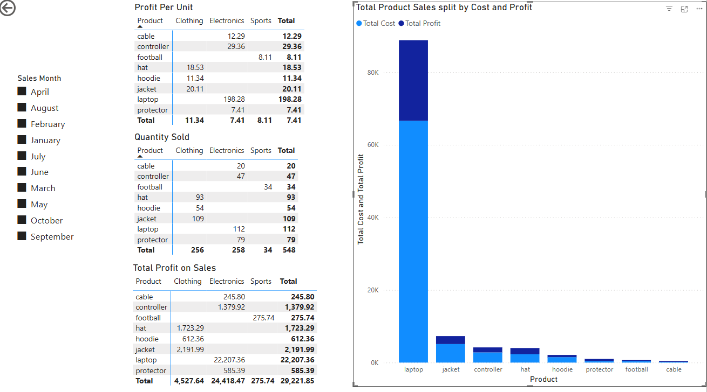

# P7. Custom BI Project (smart-sales-jillhumes)
## Section 1. The Business Goal
The goal is to identify the most profitable product, in terms of profit per unit and total profits based on sales.

## Section 2. Data Source
### Create raw data files 
Used the raw data from the sample repository as a starting point.  Modifications include:
customers_data_P7: none
products_data_P7: additional columns for UnitCost and UnitProfit
sales_data_P7: additional column for SaleMonth

### Create prepared data files by running data prep scripts
Used "prepare_XXX_data.py" files as starting point. Modifications include:
prepare_customers_data_P7.py
    updated file names for customers_data_P7.csv and customers_data_P7_prepared.csv
    updated file path to P7/data
    removed references to data_scrubber
```shell
py P7/scripts/prepare_customers_data_P7.py
```
prepare_products_data_P7.py
    updated file names for products_data_P7.csv and products_data_P7_prepared.csv
    updated file path to P7/data
    removed references to data_scrubber   
```shell
py P7/scripts/prepare_products_data_P7.py
```
prepare_sales_data_P7.py
    updated file names for sales_data_P7.csv and sales_data_P7_prepared.csv
    updated file path to P7/data
    removed references to data_scrubber    
```shell
py P7/scripts/prepare_sales_data_P7.py
```
### Create data warehouse
Used "etl_to_dw.py" script as starting point. Modifications include:
    Updated file path to P7/
    Update database schema
    Rename dataframe columns to match the database schema

Schema for dimension tables (customer & product) and fact table (sale)
  customer schema:
    customer_id INTEGER PRIMARY KEY,
    name TEXT,
    region TEXT,
    join_date TEXT,
  product schema:    
    product_id INTEGER PRIMARY KEY,
    product_name TEXT,
    category TEXT,
    unit_price REAL,
    unit_cost REAL,
    unit_profit REAL
  sale schema:
    sale_id INTEGER PRIMARY KEY,
    sale_date TEXT,
    sale_month TEXT
    customer_id INTEGER,
    product_id INTEGER,
    store_id INTEGER,
    campaign_id INTEGER,
    sale_amount_usd REAL,
    FOREIGN KEY (customer_id) REFERENCES customer (customer_id),
    FOREIGN KEY (product_id) REFERENCES product (product_id)
```shell
py scripts/etl_to_dw_P7.py
```

## Section 3. Tools Used
### Configure ODBC Data Source Name (DSN) 
    Open ODBC Data Sources (64-bit) from the Start Menu
    Click the System DSN tab
    Click Add... -> choose SQLite3 ODBC Driver -> Click Finish
    Name it SmartSalesP7
    Click Browse and select the smart_sales_P7.db database -> Click OK to save
### Connect Power BI to ODBC Data Warehouse
    Get Data -> Select ODBC
    Use dropdown menu to Select SmartSalesP7
    Select Tables -> Click Load to bring tables into Power BI

## Section 4. Workflow & Logic
### Create ProfitsByProduct Query 
Performs aggregations needed for BI Analysis
Use Odbc.Query("dsn=SmartSalesP7", "<sql query>") function to create query
    SELECT p.category, p.product_name, s.sale_month, sum(s.sale_amount_usd) AS total_sale_amount, sum(s.sale_amount_usd/p.unit_price) AS total_sale_quantity, sum(s.sale_amount_usd/p.unit_price*p.unit_cost) AS total_sale_cost, sum(s.sale_amount_usd/p.unit_price*p.unit_profit) AS total_sale_profit 
    FROM sale s 
    JOIN product p ON s.product_id=p.product_id 
    GROUP BY p.category, p.product_name, s.sale_month 
    ORDER BY p.category, p.product_name, s.sale_month
### Create Visualizations for BI Analysis
Slicer to filter on Sales Month
Matrix for Profit Per Unit by product & category
Matrix for Quantity Sold by product & category
Matrix for Total Profit on Sales by product & category
Bar Graph for Total Product Sales split by Cost and Profit

## Section 5. Results (narrative + visualizations)
Laptops are consistently the most profitable product sold each month; in terms of both profit margin and total profits on sales.


## Section 6. Suggested Business Action
Based on the successful sales of laptops, I recommend the company continue to emphasize laptops sales.
Additionally, the company should explore additional electronic products to sell, especially laptop accessories.
I recommend additional analysis of non-laptop electronic sales to identify ways to encourage the purchase of accessories with each laptop sale.  

## Section 7. Challenges
Many of the challenges in previous modules prepared me for this final project.  I did not run into any challenges for this project.

## Section 8. Ethical Considerations
Is the data being used responsibly?
    The data used for this analysis does not include personal protected information (PPI).  If the data included PPI, additional caution would be warranted to ensure the analysis meets all regulatory standards governing personal data such as the Health Insurance Portability and Accountability Act (HIPPA), the General Data Protection Regulation (GDPR), and the California Consumer Privacy Act (CCPA).  An additional consideration is that proprietary company data is being used; the data includes product cost and profitability data which the company likely does not want shared with competitors.  Responsible use of the data also includes limiting the distribution of the data and any insights gleamed from it.
Could the analysis reinforce biases?
    The data used from this analysis includes information from all sales, likely limiting the bias.  However, if the data was only captured from a subset of sales (select customers, stores, regions), the data could contain bias based on the unique characterics of the subset of sales.  
Are you making decisions based on incomplete or unverified data?
    Decisions in this analysis are being made on the data from all sales.  The data has been cleaned and prepared to ensure the quality of the data.  Analysis based on incomplete or poor quality data can lead to data bias or result in incomplete or inaccurate conclusions being drawn from the data.
How can the business use the insights responsibly?
    Transparency and accountability are important in terms of using data and it's insights responsibility.  Transparency involves the company being open and honest regarding the source and manipulation of the data.  Accountability relates to the company or company leaders taking responsibility for the creation and use of the data.